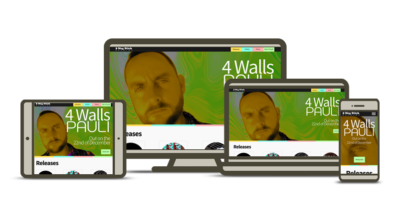

# 8 Meg Stick Records

>
> 8 Meg Stick Records is an emerging independent digital record label with a small roster of artists and releases. The label require a website to showcase 
their musical releases.
>

The site has been deployed via Github https://paulwheatcroft.github.io/MS1-8MegStick/

3 sets of target personas have been identified:

- Music enthusiast
- Musician
- Live music promoter

### Music enthusiast

This persona will have an interest in independent music. **This is the primary target persona for 8 Meg Stick Records**. They will be looking to:
- Find out information about the artist
- Be able to follow the artists
- Links to released music

### Musician

A musician will use the website to review the music released by the label with a view to submitting a demo for consideration to be released on the label. They may also wish to assess an artist with a view to partnering over live music opportunities either asking for support roles or to offer support roles.
- Found out about the label's ethos
- Find out information about the artist on the label
- Listen to music
- View live music videos
- Links to released music
- Be able to contact the label

### Live Music Promoter

This persona will be interested in understanding the suitability and capability of an artist before offering a gig opportunity.
- Find out information on the artist
- View live music videos
- Listen to music
- Be able to contact the label

### User Stories

Using the targeted personas the following list of user stories have been identified to fullfil their needs.

- I can find links to tracks on streaming sites
- I can find out information on an artist
- I can receive updates on new releases
- I can listen to what the artist sounds like
- I can find out about the label
- I can contact the label to send my demo
- I can watch a video of an artist
- I can contact the label about an artist

## Design Choices

The persona that 8 Meg Stick Records wish to primarily target are likely to be viewing the site on a phone. Therefore the site will be a mobile first approach.

The number one feature is links from each release to 6 of the most popular streaming platforms. There are:

- Spotify
- Apple Music
- YouTube Music
- Amazon Music
- Deezer
- Tidal

The look and feel of the site needs to be built around the 8 Meg Stick Records branding. The website needs to feel modern, vivid with vibrant and dynamic touches. The tone should
be professional but not corporate.

Below is the brand colour pallet for 8 Meg Stick Records. Whilst these form the foundation of the colour scheme other strong colours will be required to support vibrant 
accents on the website. Bold use of band photograpy and imagery is encouraged.

| Description | Hex Colour Value | Visual |
| --- | ----------- | --- |
| Dark grey which can be used extensively | #1a1a1a | 
------
 |
| Off white which can be used extensively | #f9f9f9 | 
------
 |
| Light yellow to be used as a primary colour | #ffdd55 | 
------
 |
| Darker yellow to be used as a secondary supportive colour | #d4aa00 | 
------
 |
| Sky blue to be used as a main highlight colour | #80ffe6 | 
------
 |

The main font used in the 8 Meg Stick Records logo is not available as a web font. This is a serif font. No other serif fonts should be used as may detract from the logo. 

The secondary font used in the logo is Noto Sans TC. This is available as a web font and will be used for headings.

Noto Sans will be used as the main content font as this is a complimentary font to Noto Sans TC.  

## Structure

Whilst the focus is on a mobile first design the website needs to provide an optimal experience across all screen types.

To ensure the experience is focussed on the releases this will be a multi-page website consisting of 4 pages.

1. releases
2. artists
3. about the label
4. contact

There will be a horizontal navigation bar at the top of each page facilitating access to other pages on the site. This navigation element will collaps on a mobile device.

The index.html page will contain the releases contect as this is the main focus of the site. All other pages will follow a consistent look and feel to the main page including 
the same footer element which contain the record labels social media links.

### The Releases Page

The top of the page needs to consist of strong imagery of the latest release or next up and coming release from the record label. This section needs to enable the 
viewer to sign up for new music release alerts from the label. This section needs to take up most but not all of the viewing area as to reveal the releases
beneath the hero image. The releases will be in in chronological order of their release. 
Each release section should display:

- Song title
- Artist name which links to the artist profile that will be situated on the artists page
- Cover art
- Links to streaming services

### The Atists Page

Beneath the navigation bar which is common to all of the pages the artists page will contain a section on each artist. This will progress down the page in alphabetical order. 
Each artist section will contain:

- Artist name
- Biography of the artist
- Links to their tracks on the releases page
- Photos and imagery (if available)
- Videos (if available)
- Social media links (if available)
- Any other links that support the artists profile

### The About Page

Beneath the navigation bar which is common to all of the pages the artists page will contain a section on the record label. This section will contain:

- An overview of the record label
- Outline the record label ethos and musical direction
- link to a form to submit a demo
- Link to a form to register for notifications of new releases
- Link to a general contact form

### The Contact Page

Beneath the navigation bar which is common to all of the pages the artists page will contain 3 forms.

1. A form to register or notifications of new releases
2. A form to submit a demo
3. A general contact form

## Wireframing

Mocking up of the site was done using Figma. I chose to use full images and colour as opposed to sketch/line drawings as the site would have many images and elements and therefore be visually busy so I needed to understand the relationships of these images such as the release cover art.

A Figma wireframe for each page can be found in the links Below.

[Releases - index.html](https://www.figma.com/file/lbEOracgvjZ4jw3uFd6hJd/8-Meg-Stick-Records?node-id=0%3A1)

[Artists](https://www.figma.com/file/lbEOracgvjZ4jw3uFd6hJd/8-Meg-Stick-Records?node-id=31%3A2)

[About](https://www.figma.com/file/lbEOracgvjZ4jw3uFd6hJd/8-Meg-Stick-Records?node-id=49%3A79)

[Contact](https://www.figma.com/file/lbEOracgvjZ4jw3uFd6hJd/8-Meg-Stick-Records?node-id=49%3A207)

## Bugs

Not able to view html div visual representation of colour swatch in GitHub even though it displays correctly in thr README.md preview.

Do I need p-2 on an IMG? It seems I don't but need to check

## Acknowledgements

[Mark Down Guide](https://www.markdownguide.org/)

README icons created by using Segoe UI Sybol font

[Google Fonts](https://fonts.google.com/) used for displaying Noto Sans and Source Sans Pro fonts 

I was able to get the YouTube videos on the Artists page to scale nicely with the Bootstrap grid system thanks to [Chris Coyier's](https://css-tricks.com/author/chriscoyier/) tutorial on [Fluid Vidio Layout](https://css-tricks.com/fluid-width-video/) 

A simple [modal image solution](https://www.tutorialspoint.com/how-to-create-a-modal-image-gallery-with-css-and-javascript) from [AmitDiwan](https://www.tutorialspoint.com/answers/amitdiwan) was used on the Artists page. 

https://www.svgminify.com/

